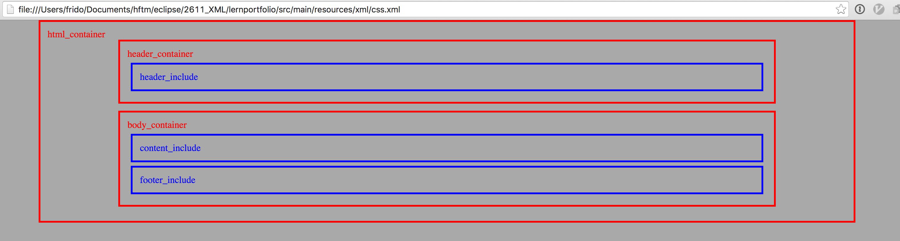
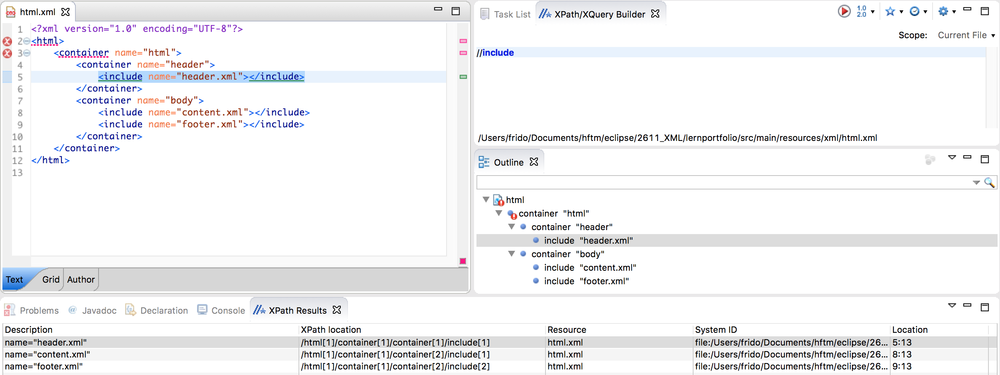

# Lernportfolio II XML

Titel:  Lernportfolio II XML  
Autor:  Fridolin Zurlinden  
Datum:  10.03.2016  

<h4>Inhaltsverzeichnis</h4>
- <h5>Einleitung</h5>
- <h5>SAX</h5>
- <h5>DOM</h5>
- <h5>Transformer</h5>
- <h5>JAXB</h5>
- <h5>CSS<h5>
- <h5>XPath</h5>
- <h5>XSLT</h5>
- <h5>Fazit</h5>


<div class="page-break"></div>

## Einleitung
Als Aufgabe für das Lernportfolio II habe ich mir zum Ziel gesetzt einen Weg zu finden wie HTML Dateien mithilfe von XML Dateien erzeugt werden können.
Es soll möglich sein XML Dateien als Templates zu verwenden und daraus dann den entsprechenden HTML Output zu generieren.

Das Lernportfolio ist in Form einer Evaluierung aufgebaut welche aufzeigt was für Möglichkeiten die jeweiligen Technologien bieten.

Da sich XML und HTML schon sehr ähnnlich sind ist der Nutzen Evaluierung nicht ganz klar.
Das Portfolio soll als Übung und Experiment im Bereich XML mit Java verarbeiten durchgeführt werden.

## SAX

Hier wurde versucht die datei `html.xml` zu parsen und die XML Elemente in HTML Elemente umzuwandeln.
Den XML Elementen wurde ein Attribut `name` gegeben welches den Namen des HTML Elements darstellt.

Hier hatte ich zuerst Schwierigkeiten das XML mit einem DTD zu parsen da ich dem Parser keinen `EntityResolver` zugewiesen hatte:
```java
xmlReader.setEntityResolver(new EntityResolver() {
			public InputSource resolveEntity(String publicId, String systemId) throws SAXException, IOException {
				if(systemId.contains("html.dtd")) {
					return new InputSource("src/main/resources/xml/html.dtd");
				} else {
				return null;
				}
			}
		});
```

Als weitere Schwierigkeit stellte sich dann hinaus das wenn die Elemente in der Methode `endElement` geschlossen wurde kein Zugriff mehr auf das Attribut aus der Methode `startElement` bestand.
Dafür wurde mit einer Hilfsklasse gearbeitet welche alle Attribute eines XML Elements enthält. Jedes Element Objekt wurde dann in der `startElement` Methode einer Liste eingefügt. So konnte in der `endElement` Methode über die Liste wieder auf die Attribute zugegriffen werden.  

Mittels einer Abfrage wurde der Inhalt der `include` Elemente zusätzlich aus einem weiteren File in den Output hineingeparst.  

```java
Element currentElement;
List<Element> elementList = new Stack<Element>();

@Override
public void startElement(String namespaceURI, String localName, String qName, Attributes atts) throws SAXException {

	// Map to save attribute values to element, no values used in this example except 'name'
	Map<String, String> attributeMap = new HashMap<String, String>();

	for (int i = 0; i < atts.getLength(); i++) {
		attributeMap.put(atts.getLocalName(i), atts.getValue(i));
	}

	if (localName.equals("include")) {
		// If an 'include' element occurs recurse into another parser which parses the file
		try {
			// Create the parser but without validation
			SAXParser saxParser = new SAXParser("src/main/resources/xml/" + attributeMap.get("name"), false);
		} catch (IOException e) { e.printStackTrace(); }
	} else {
		// Normal elments are saved to the list and printed out in HTML style, except root elements with no name attribute
		currentElement = new Element(attributeMap.get("name"), attributeMap);
		elementList.add(currentElement);
		if(currentElement.name != null) {
		System.out.println("<" + currentElement.name + ">");
		}
	}
}

@Override
public void endElement(String namespaceURI, String localName, String qName) throws SAXException {
	// Print the end tag for normal elements, here the element list helps us to retrieve the name attribute
	if (!localName.equals("include")) {
		if(elementList.get(elementList.size() - 1).name != null) {
		System.out.println("</" + elementList.get(elementList.size() - 1).name + ">");
		}
		elementList.remove(elementList.size() - 1);
	}
}
```

<div class="page-break"></div>

## DOM

Bei der Übung mit DOM wurde das File `html.xml` ebenfalls eingelesen und daraus mittels des Attributes `name` ein entsprechendes HTML Element ausgegeben.
Hier konnte mit einer rekursiven Funktion `convert` gearbeitet werden. Diese ruft sich so lange auf bis keine unterliegenden Elemente mehr vorhanden sind:
```java
public static void convert(Node node) throws DOMException, SAXException, IOException, ParserConfigurationException {
	NodeList nodeList = node.getChildNodes();
	for (int i = 0; i < nodeList.getLength(); i++) {
		Node currentNode = nodeList.item(i);
		if (currentNode.getNodeType() == Node.ELEMENT_NODE) {
			switch(currentNode.getNodeName()) {
			case "include":
				convert(DocumentBuilderFactory.newInstance().newDocumentBuilder().parse(new File("src/main/resources/xml/" + currentNode.getAttributes().getNamedItem("name").getNodeValue())).getDocumentElement());
				break;
			default:
				System.out.println("<" + currentNode.getAttributes().getNamedItem("name").getNodeValue() + ">");
				lines.add("<" + currentNode.getAttributes().getNamedItem("name").getNodeValue() + ">");
				convert(currentNode);
				break;
			}

		}

	}
	if(node.hasAttributes()) {
	System.out.println("</" + node.getAttributes().getNamedItem("name").getNodeValue() + ">");
	lines.add("</" + node.getAttributes().getNamedItem("name").getNodeValue() + ">");
	}
}
```
Bei diesem Beispiel hatte ich anfangs mühe mit der rekursiven Methode.

Anschliessend habe ich den Output nicht nur auf der Konsole ausgegeben sondern auch in ein File geschrieben.

<div class="page-break"></div>

## Transformer

Das File welches durch das DOM Beispiel geschrieben wurde war nicht sauber eingerückt und für das menschliche Auge nicht schön anzusehen.
Daher versucht ich einen Transformer zu bauen der die Elemente einrückt und das File besser lesbar macht:
```java
public class Transform {
	//Working.. But not indenting at the moment
	public void transform(String inputfile) throws Exception {
		Transformer t = TransformerFactory.newInstance().newTransformer();
		Document d = DocumentBuilderFactory.newInstance().newDocumentBuilder().parse(new InputSource(new InputStreamReader(new FileInputStream(inputfile))));
		t.setOutputProperty(OutputKeys.METHOD, "xml");
		t.setOutputProperty(OutputKeys.INDENT, "yes");
		t.setOutputProperty(OutputKeys.ENCODING, "UTF-8");
		t.setOutputProperty("{http://xml.apache.org/xslt}indent-amount", "4");
		t.setOutputProperty(OutputKeys.OMIT_XML_DECLARATION, "yes");

		Source s = new DOMSource(d);
		Result r = new StreamResult(new File("src/main/resources/xml/transform.xml"));

		t.transform(s, r);
		t.transform(s, new StreamResult(System.out));
	}

}
```
Der Transformer konnte das File lesen und auch wieder korrekt ausgeben.
Leider wurden die Element aber nicht eingerückt. Da ich schon viel Zeit mit der Fehlersuche und Lösungsfindung verbracht wurde dieses vorhaben abgebrochen.

<div class="page-break"></div>

## JAXB

Für das Beispiel mit JAXB hatte ich Anfangs Schwierigkeiten mein Vorhaben umzusetzen. Nach einiger Recherche konnte ich mir ein Bild machen wie ich das Projekt aufbauen muss.
Zu den entsprechenden Elementen aus dem `html.xml` wurden Klassen mit den JAXB Annotationen erstellt:
```java
@XmlRootElement(name="html")
@XmlAccessorType(XmlAccessType.FIELD)
public class Element {
	@XmlElement(name="container")
	private List<Container> containers;
	...
}
```
```java
@XmlAccessorType(XmlAccessType.FIELD)
public class Container {
	@XmlAnyAttribute
	private Map<QName, String> attributeMap;
	@XmlElement(name="include")
	private List<Include> includes;
	@XmlElement(name="container")
	private List<Container> containers;
	...
}
```

Mithilfe dieser Annotationen können mehrere `container` Elemente beliebig Oft ineinander verschachtelt werden und dazu auch noch `include` Elemente Enthalten.
Beim nächsten Teil der JAXB Übung habe ich versagt. Ziel war es auch dort eine rekursive Methode zu schreiben die das komplette XML ausgibt.
Mit der Handhabung der Listen welche die `container` und `include` Elemente enthalten haben kam ich aber nicht klar.
Hier habe ich auch nach meheren Anläufen abgebrochen und mich dazu entschieden mithilfe des `Marshaller` die XML Struktur auszugeben:
```java
public static void main(String[] args) throws Exception {

	InputSource inputSource = new InputSource(new FileInputStream("src/main/resources/xml/html.xml"));
	JAXBContext context = JAXBContext.newInstance(Element.class);
	Unmarshaller um = context.createUnmarshaller();
	Element e = (Element) um.unmarshal(inputSource);

	 Marshaller m = context.createMarshaller();
	 m.setProperty(Marshaller.JAXB_FORMATTED_OUTPUT, true);
	 m.marshal(e,System.out);

}
```

## CSS

Die Darstellung von XML mit CSS im Browser habe ich nicht sehr genau untersucht da mir die Methode etwas plump und nicht sehr Zeitgemäss erschien.
Zur Veranschaulichung der Struktur im `html.xml` File habe ich ein minimales CSS Mockup erstellt:
```css
html{
    background-color:darkgrey;
}
container{
    border-style:solid;
    color:red;
    width:80%;
    height:100%;
    margin:auto;
    margin-bottom:12px;
    padding:12px;
    display:block;
}

include {
    border-style:solid;
    color:blue;
    padding:12px;
    margin:6px;
    display:block;
}
```

Im Browser wird so die Verschachtelung und Hirarchie der Elemente angezeigt:


<div class="page-break"></div>

## XPath

Mit XPath habe ich mich nicht al zu stark auseinander gesetzt. Das hat mir wohl auch nachher im XLST Teil Probleme bereitet. In der Eclipse View kann über den XPath/XQueryBuilder mit Querys (ähnlich wie reguläre Ausdrücke) über das Dokument gesucht werden. Als Resultate kommen alle entsprechenden Attribute/Elemente zurück welche auf die Suche zutreffen. Praktisvh für Querys welche im XLST verwendet werden zu testen.


<div class="page-break"></div>

## XSLT

XSLT bietet die idealen Voraussetzungen XML in andere Strukturen wie z.B. HTML umzuwandeln. Mit meinem Aufbaut gelang es mir jedoch nicht einen Transformer zu schreiben der die Aufgabenstellung korrekt erfüllte. Die Problematik welche ich hatte war das die Namen der Elemente aus dem `name` Attribut des XML geholt werden mussten.
Für das setzten der Namen mit Variablen fand ich eine Lösung jedoch nicht für das saubere einsetzen im Zusammenspiel mit der Rekursion.
Hier mein Lösungsansatz:
```xml
<xsl:stylesheet xmlns:xsl="http://www.w3.org/1999/XSL/Transform" version="1.0">

    <xsl:template match="/">
            <xsl:apply-templates select="html"/>
    </xsl:template>

    <xsl:template match="html">
        <xsl:variable name="elementName" select="container/@name"/>
        <xsl:element name="{$elementName}">
            <xsl:apply-templates select="container"/>
        </xsl:element>
    </xsl:template>

    <xsl:template match="container">
        <xsl:variable name="elementName" select="container/@name"/>
        <xsl:element name="{$elementName}">
            <xsl:apply-templates select="container/@name"/>
        </xsl:element>
    </xsl:template>

    <xsl:template match="container/@name">
        <xsl:variable name="elementName" select="container/@name"/>
        <xsl:element name="{$elementName}">
            <xsl:apply-templates select="container/@name"/>
        </xsl:element>
    </xsl:template>
```

Am Ende hatte ich immer ein leeres Element mit leerem Namen was bei der Transformation zu einem Fehler führte.

<div class="page-break"></div>

## Fazit

Für meine Aufgabenstellung bietet sich das Parsen mit DOM am besten an. Mit dieser Technologie habe ich die saubersten Resultate erzielt und man ist bei der Implementierung sehr flexibel.

Das Lernportfolio hat mir persönlich sehr gepasst. Ich konnte viel mitnehmen und auch wenn auf der Suche einer Lösungsfindung viel Zeit verloren ging habe ich doch Erfahrung sammeln.
Für das nächste Mal werde ich die Aufgabenstellung welche ich  mir selber stelle etwas offener lassen. Das würde nicht so stark einschränken und bietet Ausweichmöglichkeiten falls etwas nicht funktioniert.
